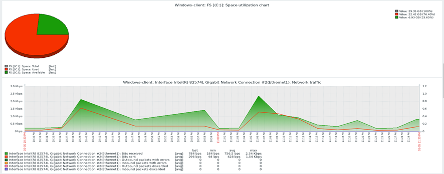
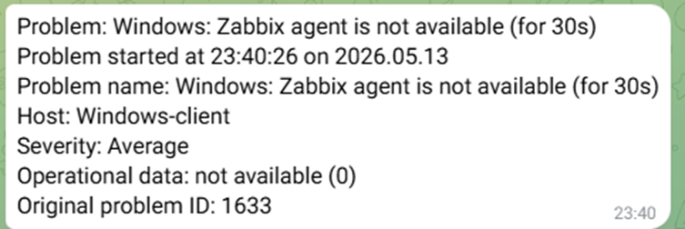

# ĐỀ TÀI: NGHIÊN CỨU VÀ TRIỂN KHAI HỆ THỐNG GIÁM SÁT HẠ TẦNG MẠNG SỬ DỤNG ZABBIX

## 1. Giới thiệu đề tài
Đề tài tập trung nghiên cứu giải pháp giám sát hệ thống mã nguồn mở Zabbix, với mục đích giám sát đa thiết bị nhằm theo dõi tài nguyên, hiệu năng và đưa ra cảnh báo kịp thời khi có sự cố xảy ra.
## 2. Mô hình hệ thống
Hệ thống bao gồm:
- 01 máy chủ Zabbix Server tích hợp MySQL
- 01 máy Ubuntu cài đặt Zabbix Agent và dịch vụ Apache để thử nghiệm giám sát web
- 01 máy Windows cài đặt Zabbix Agent
- Hệ thống gửi cảnh báo đến điện thoại quản trị viên thông qua Telegram Bot API
## 3. Chức năng hệ thống
- giám sát tài nguyên, hiệu năng các host
- cảnh báo đến quản trị viên qua Telegram
## 4. Mô hình triển khai
Hệ thống được mô phỏng hoàn toàn trong môi trường máy ảo (VMware) bao gồm các thành phần:
- **Zabbix Server và Web Frontend (Ubuntu 24.04 LTS):**- IP: `192.168.27.100`
- **Database:** MySQL Server (tích hợp cùng máy Server)
- **Host 1 (Windows 10):** -IP: `192.168.27.130`
- **Host 2 (Ubuntu 24.04 LTS):** - IP: `192.168.27.150`

## 5. Cài đặt chi tiết
Để xem các bước chuẩn bị môi trường và câu lệnh cài đặt chi tiết hệ thống này, truy cập: **[INSTALL.md](./INSTALL.md)**

## 6. Chỉnh sửa file cấu hình
Để xem các file chỉnh sửa phục vụ cho việc kết nối và giám sát của Zabbix, truy cập: **[configs](/configs)**

## 7. Kết quả thu được
Dưới đây là giao diện giám sát thực tế sau khi triển khai thành công:

### Giao diện giám sát tổng quan

### Biểu đồ giám sát tài nguyên

### Tin nhắn cảnh báo gửi về Telegram khi giả lập sự cố

