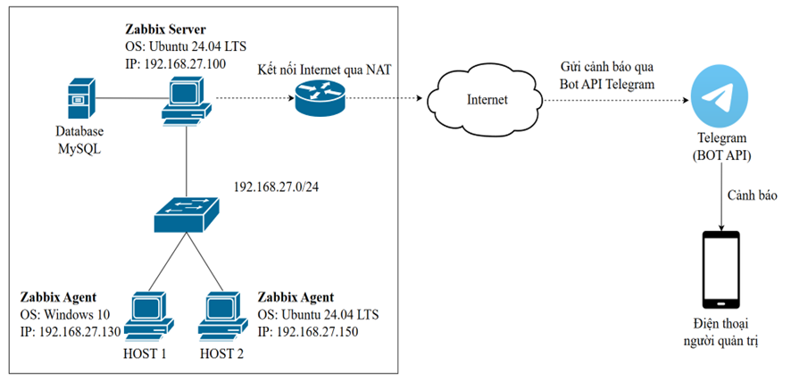
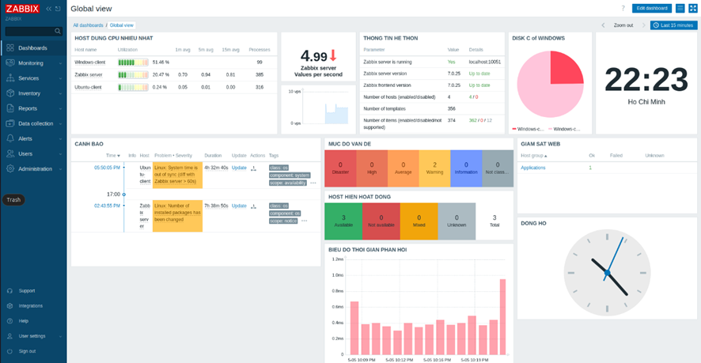

# ĐỀ TÀI: NGHIÊN CỨU VÀ TRIỂN KHAI HỆ THỐNG GIÁM SÁT HẠ TẦNG MẠNG SỬ DỤNG ZABBIX
# Sinh viên thực hiện: Nguyễn Đăng Phượng - 2121050809
## 1. Giới thiệu đề tài
Đề tài tập trung nghiên cứu giải pháp giám sát hệ thống mã nguồn mở Zabbix, với mục đích giám sát đa thiết bị nhằm theo dõi tài nguyên, hiệu năng và đưa ra cảnh báo kịp thời khi có sự cố xảy ra.
## 2. Mô hình hệ thống
Hệ thống được triển khai trong môi trường mạng nội bộ gồm:
- 1 máy chủ Zabbix Server tích hợp MySQL, có kết nối internet qua NAT
- 1 máy Ubuntu cài đặt Zabbix Agent và dịch vụ Apache để thử nghiệm giám sát web
- 1 máy Windows cài đặt Zabbix Agent
- Hệ thống gửi cảnh báo đến điện thoại quản trị viên thông qua Telegram Bot API
### Sơ đồ hệ thống như sau

## 3. Mô hình triển khai
Hệ thống được mô phỏng trong môi trường máy ảo (VMware), sử dụng phiên bản Zabbix 7.0 LTS với các thành phần:
- **Zabbix Server và Web Frontend (Ubuntu 24.04 LTS):**- IP: `192.168.27.100`
- **Database:** MySQL Server (tích hợp cùng máy Server)
- **Host 1 (Windows 10):** -IP: `192.168.27.130`
- **Host 2 (Ubuntu 24.04 LTS):** - IP: `192.168.27.150`
## 4. Các tính năng đã đạt được
* Giám sát thời gian thực (Real-time monitoring) các thông số phần cứng (CPU, RAM, Disk, Network).
* Cấu hình ngưỡng (Triggers) linh hoạt để phát hiện sự cố sớm.
* Tích hợp hệ thống cảnh báo tự động qua **Telegram Bot** ngay khi có Trigger kích hoạt.
## 5. Cài đặt và cấu hình chi tiết
Để xem các bước cài đặt  và cấu hình chi tiết hệ thống này, xem tại: **[INSTALL_AND_CONFIGS.md](./INSTALL_AND_CONFIGS.md)**

## 6. Chỉnh sửa file cấu hình
Để xem các file chỉnh sửa phục vụ cho việc kết nối và giám sát của Zabbix, xem tại: **[configs](/configs)**

## 7. Kết quả thu được
Dưới đây là giao diện giám sát thực tế sau khi triển khai thành công:

### Giao diện giám sát tổng quan

### Biểu đồ giám sát tài nguyên

### Tin nhắn cảnh báo gửi về Telegram khi giả lập sự cố

## 8. Video demo
[**video demo đồ án triển khai giám sát hạ tầng mạng sử dụng Zabbix**](https://humgedu-my.sharepoint.com/:v:/g/personal/2121050809_student_humg_edu_vn/IQCtsGoY-BJaRqcKLSPZYO8XAelsA-oTDnQUtFw0SrBDPBE)
